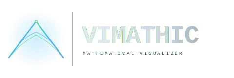

<picture>
  <source media="(prefers-color-scheme: dark)"  srcset="logo-dark.svg">
  <source media="(prefers-color-scheme: light)" srcset="logo-light.svg">
  
</picture>

# VIMATHIC™

**Mathematical VJ Studio 1.0 (Beta)**
Drop in a track — 192 mathematical formulas come to life on screen, driven by your music in real time.


> ⚠️ **Disclaimer:** This project was built with AI assistance (Claude, Anthropic).
> Mathematical, scientific, and legal claims have not been independently verified by domain experts.
> Photosensitive users should read the disclaimer before using.
> [Full disclaimer →](./DISCLAIMER.md)

---

> **164 of 192 formulas at verifiable accuracy. Open tests.**
>
> 120 closed-form expressions at IEEE 754 double precision (~10⁻¹⁴).
> 44 validated approximations with bounded error ≤ 10⁻⁷.
> 28 visualisation-grade (qualitatively faithful, not numerically verified).
> Cross-checked against mpmath, scipy.special, and NIST DLMF.
> `node --test tests/math-validation.test.js`

---

## Quick Start

**Option A — try it online:**

👉 **[vimathic.com](https://vimathic.com)** — open in Chrome or Edge, no install required.

**Option B — run it locally:**
```
dist/index.html   ← open in any modern browser, no server needed
```

**Option C — dev mode:**
```bash
git clone https://github.com/vimathic/vimathic
cd vimathic
npm install
npm run dev
```

**Option D — build your own single file:**
```bash
npm run build    # → dist/index.html  (self-contained, no external deps)
```

---


---

## What It Is

VIMATHIC is a **mathematical VJ studio** that turns your music into reactive geometry.
Not a player with presets, not a winamp visualizer clone: a generator that
*computes* every frame from canonical mathematics and the spectral content
of whatever you're listening to.

Load a track (or mic, tab audio, system audio) — the music drives everything
in real time.

**Bass** and **treble** push geometry into motion. **Beat detection** runs in
the background — its BPM feeds the Camera Programmer and the beat-synced GIF
recorder, while its direct effect on the default visualisation is intentionally
muted. MIDI controllers map to any parameter. A second screen or projector
connects in one click.

Swap the formula, the shape, the colour scheme, and other knobs — and dive
into geometry you didn't expect.

### A combinatorial space, not a preset gallery

VIMATHIC was designed as a *generator of visual diversity*. The five primary
axes — geometry, formula, colour scheme, render mode, deformation mode —
multiply out to a state space of this size before any slider, audio input, or
custom code enters the picture:

| Axis | Count |
|---|---|
| 3D shapes (Plane, Sphere, Torus, Icosahedron, and others) | 20 |
| Formulas (192 CPU + 38 GPU shaders) | 230 |
| Colour schemes | 36 |
| Render modes (surface / wireframe / points) | 3 |
| Deformation modes (surface / volume / collapse) | 3 |
| Volume vector fields (when Volume mode is active) | 6 |

Counting these combinations honestly — accounting for the fact that Volume
mode replaces the formula slot with one of 6 vector fields, while Surface and
Collapse use the chosen formula — gives **roughly one million distinct base
states**.

That's before:

- 7 audio-reactive sliders (amplitude, wave intensity, bass/treble sensitivity, bloom, colour, rotate-speed)
- The MIDI mapping table (any CC → any parameter)
- 7 toggleable post-processing effects with continuous parameters
- The **Camera Programmer** (arbitrary JavaScript camera scripts + keyframe timeline)
- The **GLSL Shader Editor** (live-edit vertex and fragment shaders)
- The audio itself — every track produces a different spectral fingerprint

Add the continuous dimensions — sliders, MIDI, audio itself — and the space
becomes **effectively unbounded**. VIMATHIC is a generator for exploration,
not a catalogue of finished pieces.

---

## Features

### 192 Mathematical Formulas across 12 domains
Fractals & Chaos · Special Functions · Probability & Statistics · Linear Algebra ·
Trigonometry · Complex Numbers · Fourier Series · Differential Equations ·
Integral Transforms · Topology & Geometry · Cellular Automata · Quantum Mechanics

**Accuracy tiers** — see [MATHEMATICAL_ACCURACY.md](./MATHEMATICAL_ACCURACY.md) for full breakdown:

| Tier | Count | What it means |
|------|-------|---------------|
| 🟢 A | 120 | IEEE 754 double precision — machine accuracy |
| 🔵 B | 44  | Bounded approximation, error ≤ 10⁻³ to 10⁻⁷ |
| 🟡 C | 28  | Visualization-grade — qualitatively faithful, not numerically exact |

This is not "math-flavoured visuals". These are canonical implementations —
Bessel J₁ from Numerical Recipes, Gamma via Lanczos g=7, Dawson F via Taylor + asymptotic series,
Gray-Scott reaction-diffusion as a real PDE on a 64×64 grid.

### 38 GPU Shaders
Ramanujan modular forms, Mandelbrot, wave and heat equations, Lorenz attractor, Schrödinger —
running in real time on the GPU with audio-reactive uniforms.

### 36 Colour Schemes
Cinematic, Synthwave, Scientific, Premium, Monochrome, Trending, and a 12-palette "New" collection (cyberpunkGold, arcticFire, bloodMoon, cosmicDust, toxicWaste, cherryBlossom, midnightChrome, solarFlare, deepSpace, acidRain, volcanic, bioluminescence).

### Deformation Modes
- **Surface** — classic height-field displacement along Y axis
- **Volume** — full 3D vector-field deformation (6 built-in fields: Lorenz, twist, magnetic dipole, etc.)
- **Collapse** — spherical-parametrization displacement along surface normals

### Post-Processing Effects
Bloom · God Rays · Motion Blur · Chromatic Aberration · Afterglow · Film Grain · Vignette
— all toggleable in real time, GPU-accelerated via custom GLSL shaders

### Audio Engine
- File playback (MP3, WAV, FLAC, OGG) with drag & drop
- Crossfade between tracks (configurable duration)
- Bass / Mid / Treble sensitivity controls
- Beat detection in the background — feeds BPM to the Camera Programmer and beat-synced GIF recorder; the visualizer deliberately holds back on flash response in the default scene
- Live microphone input (works with virtual loopback devices: VB-Audio Cable, BlackHole)
- Browser tab audio capture (Chrome)
- System audio capture (Windows Chrome)
- MIDI controller support — any CC → any parameter, with Learn mode

### Production Tools
- **Clip Player** — automate formula/shader sequences in seconds or bars, with background-tab catch-up
- **Camera Programmer** — keyframe camera paths in JavaScript
- **GLSL Shader Editor** — live-edit vertex and fragment shaders in-app
- **About / Docs modal** — full documentation embedded in-app, browser-style tabs
- **Second Screen** — borderless popup for projector or external monitor
- **Virtual Camera** — feed into OBS, Zoom, any capture device (Chrome)
- **NDI / Spout stubs** — architecture ready for Electron-based bridge to professional VJ software

### Recording & Export
- **GIF Recorder** — beat-synchronized animated GIF (perfect loop mode)
- **WebM Recorder** — high-quality VP9/VP8 capture via MediaRecorder
- Configurable resolution, FPS, quality, and duration (seconds or beats)
- Automatic "VIMATHIC" watermark on exported media

### Single-File Deploy
The entire application builds to one `dist/index.html` (plus a companion Web Worker, the second-screen popup, and an SEO docs site) — no server, no CDN, no external requests.
Share it as a file attachment. Open from USB. Works offline.

---

## Architecture

```
src/
  main.js              — bootstrap, event loop, hotkeys
  render.js            — Three.js renderer, geometry, animation, post-processing
  shaders.js           — GLSL shaders (36 colour schemes, 38 GPU formulas)
  math-collections.js  — 192 CPU formula implementations + 6 volume vector fields
  math-visualizer.js   — CPU math engine (worker/sync hybrid)
  math-worker.js       — Web Worker for off-main-thread evaluation
  camera.js            — Camera physics, programmer, keyframes
  audio.js             — Web Audio API, FFT, beat detection, live capture
  dom.js               — Centralised DOM lookups (single source of truth)
  params.js            — Declarative parameter registry (slider + MIDI + presets)
  utils.js             — MIDI controller, ShuffleBag
  recorder.js          — GIF + WebM recorders with watermark
  outputs.js           — Second screen, virtual camera, NDI/Spout stubs
  ui/
    controller.js      — UIController + ClipPlayer wiring
    controls.js        — Panel sliders, hotkeys, fullscreen, model loader
    modals.js          — Shader / camera / output / audio-source / MIDI modals
    presets.js         — Capture/apply state, import/export JSON, migration registry
    clip-player.js     — Sequence automation with backgrounded-tab catch-up
    about-modal.js     — Documentation viewer with browser-style tabs

plugins/
  vimathic-docs.js     — Vite plugin: documents/*.md → app modal + static SEO site

documents/             — Markdown documentation (loaded into About modal + indexed by Google)
  quick-start.md  hotkeys.md  midi.md  camera-programmer.md
  shader-editor.md  recording.md  presets.md  output.md  troubleshooting.md
  roadmap.md  safety.md  science.md  license.md
```

**Stack:** Three.js (WebGL) · Web Audio API · Web MIDI API · Vite + vite-plugin-singlefile · micromark (build-time)
**Tests:** `node --test` — no test framework dependency
**CI:** GitHub Actions — math tests + single-file build verification on every push

---

## Why It Works

Two independent lines of published research are *adjacent* to what VIMATHIC does:
fractal patterns produce measurable EEG signatures including elevated alpha activity
([Hägerhäll et al., 2008](https://doi.org/10.1068/p5918)), and audiovisual stimulation
has shown anxiety-reduction effects comparable to short meditation in a controlled trial
([Johnson et al., 2024](https://doi.org/10.1038/s41598-024-75943-8)).

Neither study used VIMATHIC. The combination of *user-chosen music + real-time
mathematical animation* has not been studied. We don't make therapeutic claims.
[Read the research →](./SCIENCE.md)

---

## Authorship

VIMATHIC was designed and built by **S. Melentyev** in close collaboration with [Claude](https://claude.ai) (Anthropic). The project direction, design choices, scope, and decisions about what's in and what's out are the author's. The code, mathematical implementations, accuracy methodology, reference-value checks against mpmath / scipy.special / NIST DLMF, and the test suite that verifies them — were produced with Claude.

Where the author's role was strongest: deciding what the instrument should *be*, which formulas matter, how the parameter space should feel, and which trade-offs to accept. Where Claude's role was strongest: turning those decisions into working code, building out the math library, drafting documentation, and writing the tests that check it.

*This is mentioned because honesty matters more than the optics of it.*

---

## Support

VIMATHIC 1.0 is free, ad-free, telemetry-free, and open-source — forever.
For the roadmap of what comes next and ways to support development,
see the [Roadmap](./documents/roadmap.md).

---

## Documentation

**For users:** the in-app **About modal** (click the **i** icon next to FPS) and the live docs site at
**[vimathic.com/docs/](https://vimathic.com/docs/)** — quick start, hotkeys, MIDI, shader editor, camera programmer, recording, presets, output, roadmap, troubleshooting.

The [Roadmap](./documents/roadmap.md) lays out what VIMATHIC is today, the planned next step (mobile app), and how community support shapes what comes after.

**For developers / contributors:**

- [MATHEMATICAL_ACCURACY.md](./MATHEMATICAL_ACCURACY.md) — accuracy methodology, per-formula tier breakdown
- [SCIENCE.md](./SCIENCE.md) — research behind the neuroscience and why it works
- [DISCLAIMER.md](./DISCLAIMER.md) — photosensitivity warning, AI-assisted authorship, hardware notes
- [DEPLOYMENT.md](./DEPLOYMENT.md) — deployment guide and single-file build instructions
- [SECURITY.md](./SECURITY.md) — vulnerability disclosure policy
- [LICENSE.txt](./LICENSE.txt) — BUSL-1.1 with educational exception → GPL v3 on 2031-05-09

---

## License

**[BUSL-1.1](./LICENSE.txt)** — source-available, non-competing use only.

**Educational exception:** accredited schools, universities, and non-profit educational
organizations may use VIMATHIC under Apache 2.0 terms immediately, free of charge.

**After 2031-05-09:** the codebase converts to **GPL v3** — a copyleft open-source license.
Any derivative work that gets distributed must remain open-source under GPL v3.
No company can take this code and lock it behind a paywall.

Uses [Three.js](https://threejs.org) © mrdoob, MIT License.

### Bundled audio

VIMATHIC ships with an intro track — *S. Melentyev — Vimathic* (`vimathic-intro.mp3`) — that plays on first load. It's © 2026 S. Melentyev, licensed for personal/non-commercial playback inside the app. Public live use, monetised streaming, sampling, and commercial use require separate permission. See [LICENSE.txt](./LICENSE.txt) for the full bundled-media clause. Click **Clear** in the playlist to skip it and load your own music.

---

## Contact

For collaboration, licensing, or urgent matters: **vimathic.info@proton.me**
Security vulnerabilities or conduct reports: **vimathic.reports@proton.me**

*One person maintaining this in spare time. Replies aren't guaranteed and may take a while. For bugs, [GitHub Issues](https://github.com/vimathic/vimathic/issues) are faster.*

---

<sub>VIMATHIC™ · v1.0 (Beta) · Mathematical VJ Studio · Built with mathematics, music, and a browser</sub>
